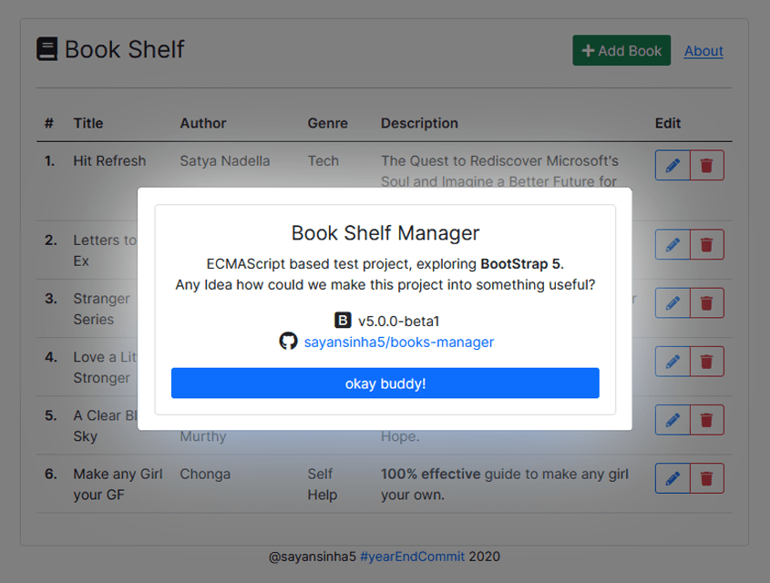
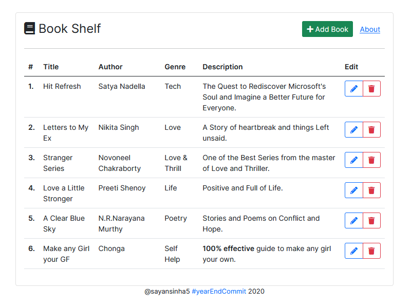
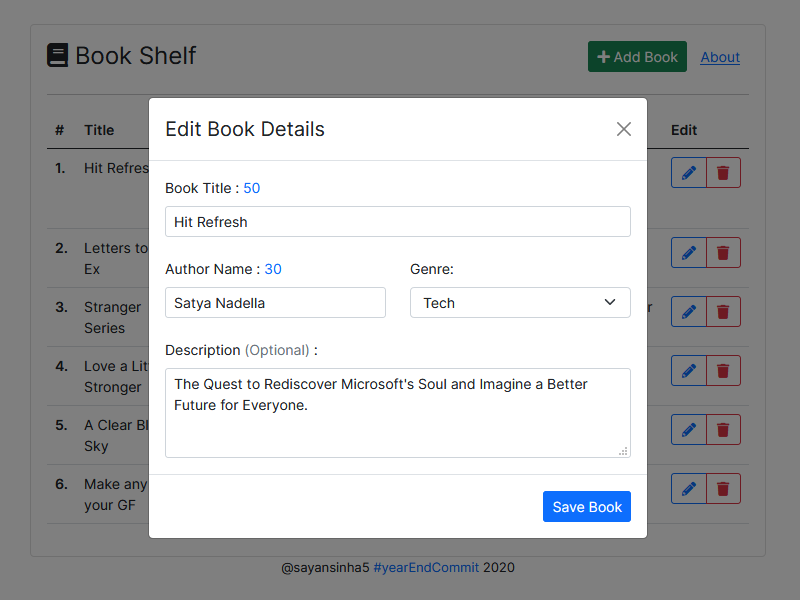
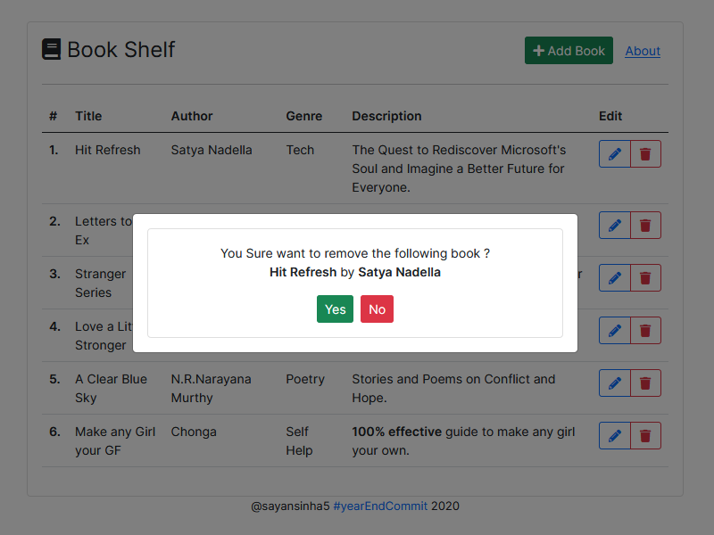

## Book Shelf Manager
### You Like Books, so do I :)
- Exploring <b>BootStrap 5 (v5.0.0-beta1)</b>.
- ES based Test project.

### Current Features
- [x] Add Book
- [x] Edit Book
- [x] Delete Book

### Requirements
- Internet Connection for the CDNs

### How to start?
- Step 1: Download the Files.
- Step 2: Open <b>index.html</b> on a browser.

### All Done!

## Project Screenshots

### 1. Main Screen

### 2. Add Book

### 3. Edit Book

### 4. Delete Book

